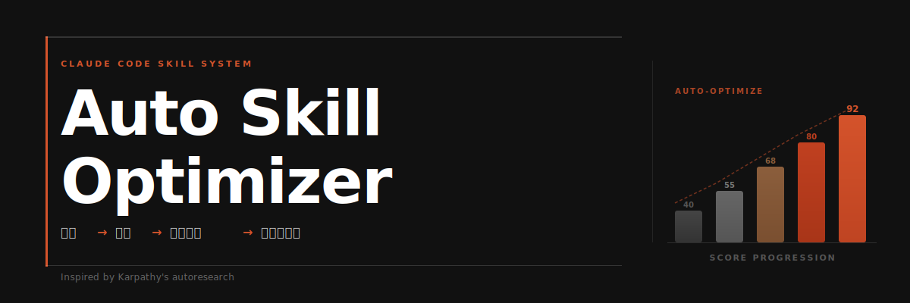
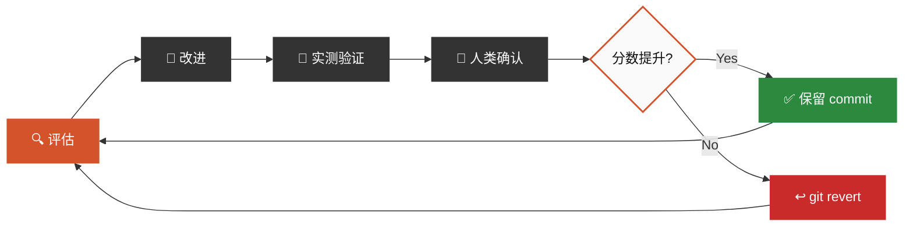
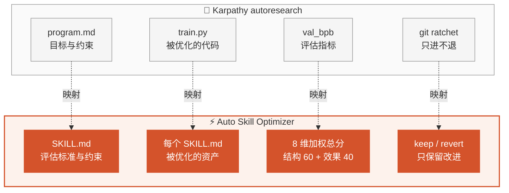
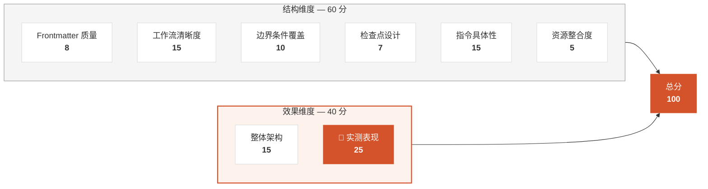
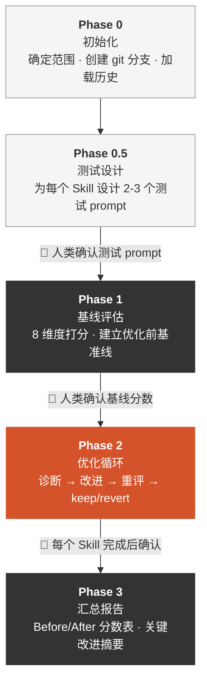
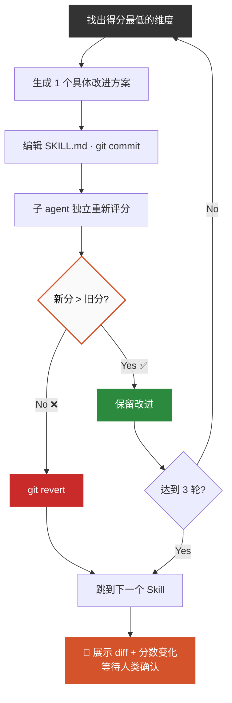
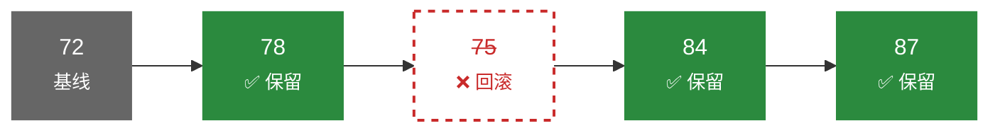
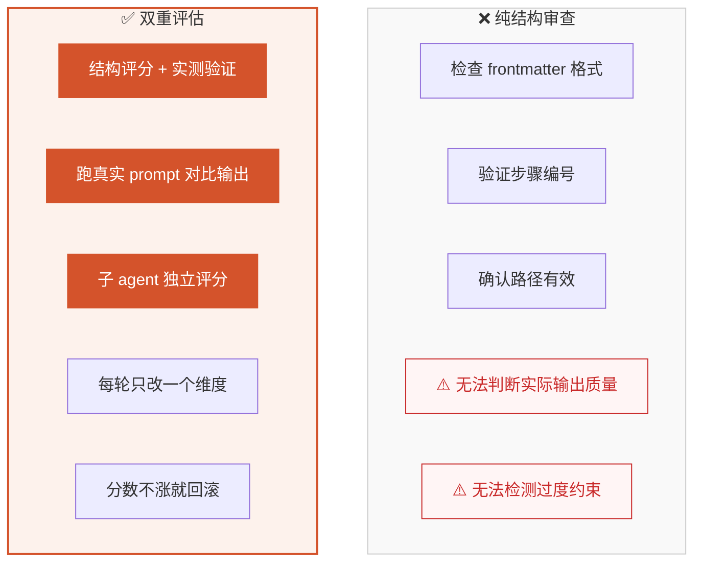

# Auto Skill Optimizer

**像训练模型一样优化你的 Claude Code Skills。**

受 [Andrej Karpathy 的 autoresearch](https://github.com/karpathy/autoresearch) 启发，将自主实验循环从模型训练搬到 Skill 优化领域。一个只能向前转的棘轮。

> [**查看可视化展示页 →**](https://alchaincyf.github.io/auto-skill-optimizer/)

---

## 核心循环



---

## 为什么做这个

Claude Code 的 Skill 生态在快速扩张。当你有 10 个 Skills 时可以手动维护；当你有 60+ 个 Skills 时，你需要一个系统。

传统的 Skill 审查是**纯结构性的**：检查格式对不对、步骤有没有编号、路径能不能访问。但一个格式完美的 Skill，跑出来的效果可能很差。

Auto Skill Optimizer 同时评估**结构质量**和**实际效果**，然后只保留真正有改进的修改。

---

## 从 autoresearch 到 Skill Optimizer



关键区别：autoresearch 全自主运行（loss 可以自动比较），Skill 优化增加了**人在回路**。因为 Skill 的「好坏」不像 loss 那样可以纯数值判断。

---

## 五条核心原则

```
01  单一可编辑资产    每次只改一个 SKILL.md，变量可控，改进可归因
02  双重评估         结构评分（静态分析）+ 效果验证（跑测试看输出）
03  棘轮机制         只保留改进，自动回滚退步，分数只升不降
04  独立评分         评分用子 agent，避免「自己改自己评」的偏差
05  人在回路         每个 Skill 优化完后暂停，用户确认再继续
```

---

## 8 维度评估体系

总分 100。结构维度靠静态分析（60分），效果维度必须实测（40分）。



> 实测表现权重最高（25分）。Skill 写得再漂亮，跑出来效果不好就是零。

---

## 优化循环：5 个阶段



**Phase 2 的核心逻辑**：



---

## 棘轮机制

分数只能上升。每一轮要么改进 Skill，要么干净地回滚。不会随时间积累局部退化。



轮次 2 的 75 分低于当前最优的 78 分，被自动回滚。有效基线始终锁定在 78，后续改进从 78 继续。

---

## 为什么需要双重评估



---

## 快速开始

### 安装

```bash
# 将 SKILL.md 放入 Claude Code Skills 目录
mkdir -p ~/.claude/skills/huashu-auto-skill-optimizer
cp SKILL.md ~/.claude/skills/huashu-auto-skill-optimizer/SKILL.md
```

### 使用

```
# 评估所有 Skills（只评估不改）
> 评估所有 skills

# 优化指定 Skill
> 优化 huashu-slides 这个 skill

# 全量优化（推荐首次使用）
> 优化所有 skills

# 查看历史
> 看看 skill 优化历史
```

### 输出示例

```
┌──────────────────────────┬────────┬────────┬────────┐
│ Skill                    │ Before │ After  │ Δ      │
├──────────────────────────┼────────┼────────┼────────┤
│ huashu-proofreading      │ 78     │ 87     │ +9     │
│ huashu-slides            │ 72     │ 83     │ +11    │
│ huashu-publish           │ 81     │ 88     │ +7     │
├──────────────────────────┼────────┼────────┼────────┤
│ 平均                     │ 77     │ 86     │ +9     │
└──────────────────────────┴────────┴────────┴────────┘
```

---

## 设计灵感

这个项目的设计直接受 **Andrej Karpathy 的 [autoresearch](https://github.com/karpathy/autoresearch)** 启发。

autoresearch 证明了一个优雅的想法：你可以把「写论文」这件事变成一个自主实验循环。定义目标（`program.md`），让 agent 不断生成和测试变更（`train.py`），用可量化的指标（`val_bpb`）决定保留还是回滚。

Auto Skill Optimizer 把同样的思路搬到了 Claude Code Skill 优化。区别在于：

1. **评估更复杂**：需要 8 个维度的加权评分，单一数值说不清楚
2. **需要实测**：结构评分只是一半，另一半必须跑真实 prompt 看效果
3. **人在回路**：Skill 的「好」是主观的，需要人来做最终判断

核心机制完全相同：**只保留可测量的改进，其余全部回滚。**

---

## 约束规则

1. 不改变 Skill 的核心功能和用途
2. 不引入新依赖
3. 每轮只改一个维度，避免多变更无法归因
4. 优化后 SKILL.md 不超过原始大小的 150%
5. 所有改动在 git 分支上，用 git revert 回滚
6. 效果维度必须用子 agent 评分，不能自己改完自己评

---

## 文件结构

```
auto-skill-optimizer/
├── README.md              # 你正在看的文件
├── SKILL.md               # 核心：评估标准 + 优化流程 + 约束规则
├── showcase.html          # Pentagram 风格的可视化展示页（可本地打开）
└── assets/
    └── aso-hero.png       # README 配图
```

---

## 致谢

- [Andrej Karpathy](https://github.com/karpathy) 的 [autoresearch](https://github.com/karpathy/autoresearch) 提供了核心设计灵感
- [Claude Code](https://claude.ai/code) 的 Skill 生态提供了优化场景
- [花叔](https://x.com/AlchainHust) 的 60+ Skills 实践提供了真实测试环境

---

**License**: MIT
